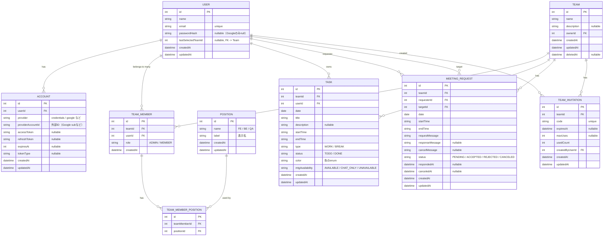

# ER 図（Mermaid）

以下は本プロジェクトで利用するデータモデルの ER 図です。 Mermaid をサポートする環境で可視化できます。

```mermaid
erDiagram

  USER {
    int      id PK
    string   name
    string   email  "unique"
    string   passwordHash "nullable（Googleのみnull）"
    int      lastSelectedTeamId "nullable, FK -> Team"
    datetime createdAt
    datetime updatedAt
  }

  ACCOUNT {
    int      id PK
    int      userId FK
    string   provider          "credentials / google など"
    string   providerAccountId "外部ID（Google subなど）"
    string   accessToken       "nullable"
    string   refreshToken      "nullable"
    int      expiresAt         "nullable"
    string   tokenType         "nullable"
    datetime createdAt
    datetime updatedAt
  }

  TEAM {
    int      id PK
    string   name
    string   description "nullable"
    int      ownerId FK
    datetime createdAt
    datetime updatedAt
    datetime deletedAt "nullable"
  }

  TEAM_MEMBER {
    int            id PK
    int            teamId FK
    int            userId FK
    string         role "ADMIN / MEMBER"
    datetime       createdAt
  }

  POSITION {
    int      id PK
    string   name  "FE / BE / QA"
    string   label "表示名"
    datetime createdAt
    datetime updatedAt
  }

  TEAM_MEMBER_POSITION {
    int      id PK
    int      teamMemberId FK
    int      positionId   FK
  }

  TASK {
    int      id PK
    int      teamId FK
    int      userId FK
    date     date
    string   title
    string   description "nullable"
    string   startTime
    string   endTime
    string   type        "WORK / BREAK"
    string   status      "TODO / DONE"
    string   color       "色のenum"
    string   mtgAvailability "AVAILABLE / CHAT_ONLY / UNAVAILABLE"
    datetime createdAt
    datetime updatedAt
  }

  MEETING_REQUEST {
    int      id PK
    int      teamId      FK
    int      requesterId FK
    int      targetId    FK
    date     date
    string   startTime
    string   endTime

    string   requestMessage
    string   responseMessage  "nullable"
    string   cancelMessage    "nullable"

    string   status      "PENDING / ACCEPTED / REJECTED / CANCELED"
    datetime respondedAt "nullable"
    datetime canceledAt  "nullable"

    datetime createdAt
    datetime updatedAt
  }

  TEAM_INVITATION {
    int      id PK
    int      teamId        FK
    string   code          "unique"
    datetime expiresAt     "nullable"
    int      maxUses       "nullable"
    int      usedCount
    int      createdByUserId FK
    datetime createdAt
    datetime updatedAt
  }

  USER ||--o{ ACCOUNT            : has
  USER ||--o{ TEAM_MEMBER        : "belongs-to many"
  TEAM ||--o{ TEAM_MEMBER        : "has many"

  TEAM_MEMBER ||--o{ TEAM_MEMBER_POSITION : has
  POSITION ||--o{ TEAM_MEMBER_POSITION    : used-by

  TEAM ||--o{ TASK               : has
  USER ||--o{ TASK               : owns

  TEAM ||--o{ MEETING_REQUEST    : has
  USER ||--o{ MEETING_REQUEST    : requester
  USER ||--o{ MEETING_REQUEST    : target

  TEAM ||--o{ TEAM_INVITATION    : has
  USER ||--o{ TEAM_INVITATION    : created
```
